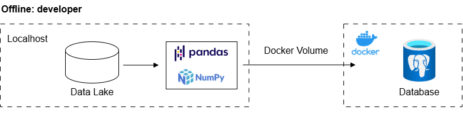
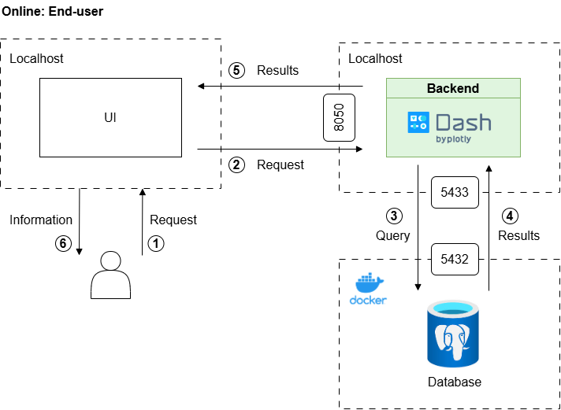
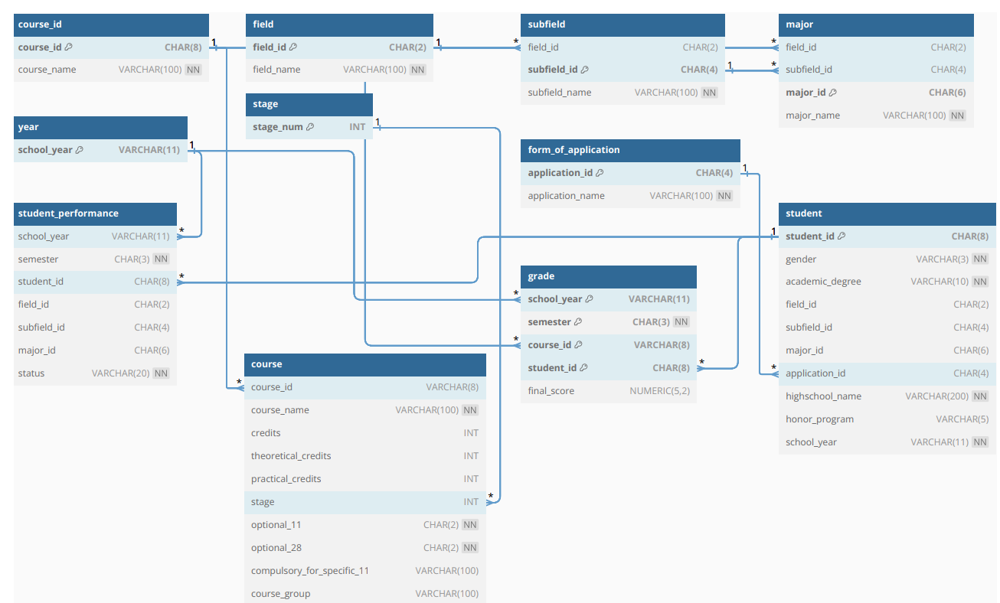

# HCMUS Student Academic Performance Monitoring Dashboard

This project is a self-hosted dashboard developed to visualize and analyze the academic results and output quality of students, specifically targeting the management needs of the Faculty of Mathematics and Computer Science at the University of Science (HCMUS).

The dashboard aims to provide a comprehensive and intuitive overview of student performance, supporting analysis, evaluation, and comparison of training quality across different cohorts, admission methods, and majors,. The specific focus of the project is on managing and evaluating 300 students from the 2021-2025 cohort.

# Core Objectives

*   **Database Simulation and Management:** Build and simulate a complete educational relational database schema optimized for integrity, flexible storage, querying, and data security.
*   **Data Visualization:** Develop a self-hosted dashboard interface that utilizes interactive charts to visualize student data dynamically,.
*   **Quality Assessment:** Support the assessment of overall academic performance and output quality based on various criteria, including admission methods and initial input majors.

# Technology Stack

The system is designed with a self-hosted architecture implemented using Docker and Python libraries.

| Component | Technology | Role |
| :--- | :--- | :--- |
| **Dashboard Framework** | **Dash** (Plotly, Flask, React) | Provides the web application interface and handles interactivity using Python callbacks. |
| **Data Processing** | **Python, Pandas, SQLAlchemy** | Used for efficient data retrieval, manipulation, and establishing connection between the dashboard and the database. |
| **Database Management** | **PostgreSQL** | Chosen as the Relational Database Management System (DBMS) for its high performance, integrity, and scalability. |
| **Environment & Deployment** | **Docker, Docker Compose** | Ensures a consistent, isolated, and easily manageable execution environment for both the DBMS and the application. |
| **Interface** | **HTML and CSS** | Used for designing a user-friendly and approachable dashboard layout. |

# Overall Workflow
## Offline: developer


## Online: End-user


# Data (Input & Output)

## Input Data

The input data consists of simulated data modeled after the 2021 training program structure and student profiles (300 students) found on the university's portal system,.

The relational database schema is modeled through several key tables defined by their attributes and relationships (ERD model used for design),:

*   **Student Information:** `student`, `student_performance`
*   **Course Information:** `course_id`, `course`
*   **Curriculum Structure:** `field` (Input Major), `subfield` (Sub-Major), `major` (Specialization), `stage` (Academic stage/Phase), `year` (Academic Year).
*   **Performance:** `grade` (containing `final_score` for courses).
*   **Admission Method:** `form_of_application` (details on how the student was admitted).

Data files are loaded into the PostgreSQL database using CSV files (e.g., `course_id.csv`) located within the `/var/lib/postgresql/data/data_files/` directory inside the Docker container.

### ERD Diagram


## Output and Visualizations

The dashboard utilizes various interactive visualizations built with Dash and Plotly, including:

1.  **Donut Chart:** Used to display ratio distributions, such as the total number or percentage of students by gender.
2.  **Bar Chart:** Employed for comparing quantitative values across categories, such as the distribution of students with specific GPA ranges across different admission methods.
3.  **Sankey Diagram:** Visualizes the flow and quantitative relationships between stages, such as the flow of students from majors to interested domains and future careers.
4.  **Radar Chart:** Used for comparing multiple variables across groups, such as the average GPA for students pursuing different `Future Careers` within a specific `Interested Domain` (e.g., Artificial Intelligence).


# Environment Setup (Using Docker Compose)

The environment is set up using `docker-compose.yml` to launch two core services: the PostgreSQL database and the pgAdmin management interface,.

To run the required services:

1.  Ensure Docker Desktop is installed and running.
2.  Navigate to the project directory containing the `docker-compose.yml` file.
3.  Execute the Docker Compose command to start the services:

```bash
docker-compose up -d
```

## Accessing the Database

The `docker-compose.yml` file configures the services with the following access details,:

| Service | Port |
| :--- | :--- | 
| **PostgreSQL (`db`)** | `5433:5432` |
| **pgAdmin (`pgadmin`)** | `5050:80` | 

After running Docker Compose, you can access pgAdmin via a web browser at `http://localhost:5050` to manage the database and load the simulated data files.


# Running the Dashboard Application

The application logic is executed via `app.py`, which initializes the Dash application, connects to the PostgreSQL database, processes the data using Pandas/SQLAlchemy, and generates the required visualizations,.

Before running `app.py`, ensure the necessary Python packages are installed using the `environment_packages.yml` file (e.g., via Conda).

```bash
conda env create -f environment_packages.yml
conda activate <environment_name>
python app.py
```

## Main Classes and Components

The dashboard application architecture relies on Python classes to ensure **clear organization, easy maintenance, and reusability** of code, encapsulating related attributes and methods. The application utilizes four primary custom classes, all located within the `majors/` directory:

### 1. DatabaseHandler

The `DatabaseHandler` class is foundational, managing the connection and interaction with the PostgreSQL database using SQLAlchemy.

| Feature | Role |
| :--- | :--- |
| **Primary Goal** | Provides a flexible way to **connect, execute SQL queries, and manage database resources**. |
| **Connection** | Initializes the connection using parameters (username, password, host, port, DB name) and an SQLAlchemy engine. |
| **Query Execution** | Executes SQL queries and returns results, typically as **pandas DataFrames** for multi-row results or a single **scalar value**. |
| **Connection Management** | Includes methods to obtain the connection or **close the engine connection** when no longer needed, conserving resources. |

### 2. Overview

The `Overview` class focuses on processing and visualizing aggregated data, providing a general summary of student performance.

| Feature | Role |
| :--- | :--- |
| **Inheritance** | **Inherits from `DatabaseHandler`** to access underlying database connection and querying capabilities. |
| **Functionality** | Handles the retrieval, preprocessing, and visualization of overall student data. |
| **Visualizations** | Provides methods to **draw common overview charts**, such as the Donut chart (ratio distributions), horizontal Bar charts (e.g., GPA ranges), and the overall Sankey flow diagram. |

### 3. Mathematics and 4. DataScience

The `Mathematics` and `DataScience` (KDL) classes are specialized components designed to handle data and visualizations unique to their respective student groups.

| Feature | Role |
| :--- | :--- |
| **Specialization** | Each class processes data specific to the **Mathematics Major Group** (TTH) or the **Data Science Major** (KDL). |
| **Inheritance** | Both classes **inherit from `DatabaseHandler`** to leverage database query methods. |
| **Core Tasks** | Focus on **preprocessing major-specific data** and generating specialized analysis. |
| **Visualizations** | Contain methods to draw specific charts relevant to their fields, notably the **Radar chart** (used for comparing GPA across different career pursuits), and specialized Bar charts. |

# Project Structure

The main project directory structure is as follows:

```
HCMUS_DASHBOARD/
├── __pycache__/
├── assets/         # designing the application's interface.
│   └── style.css (and image files)
├── data/
├── majors/
│   ├── database_handler.py
│   ├── mathematics.py
│   ├── datascience.py
│   └── overview.py
├── pages/         # displaying the application interface.
│   ├── about.py
│   ├── callbacks.py
│   ├── config_eng.py
│   ├── config_vie.py
│   └── home.py
├── utils/          # essential data processing and chart plotting functions.
│   ├── barchart.py
│   ├── color_utils.py
│   ├── constant.py
│   ├── donut.py
│   ├── preprocessing.py
│   ├── radarchart.py
│   ├── sankey.py
│   └── table.py
├── app.py          # the entry point for running the Dash application.
├── docker-compose.yml
├── environment_packages.yml
└── query.txt       # queries
```